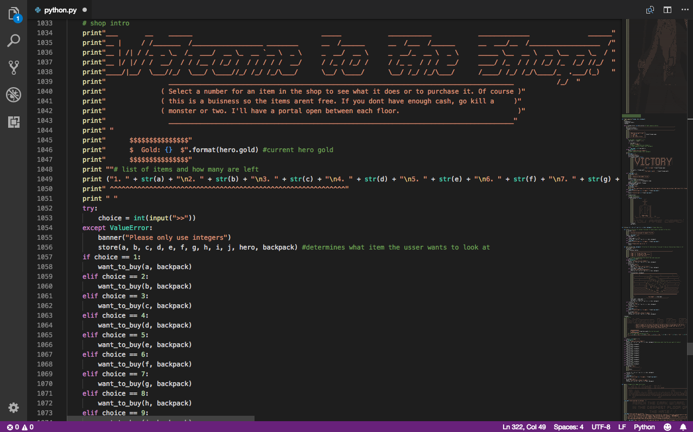
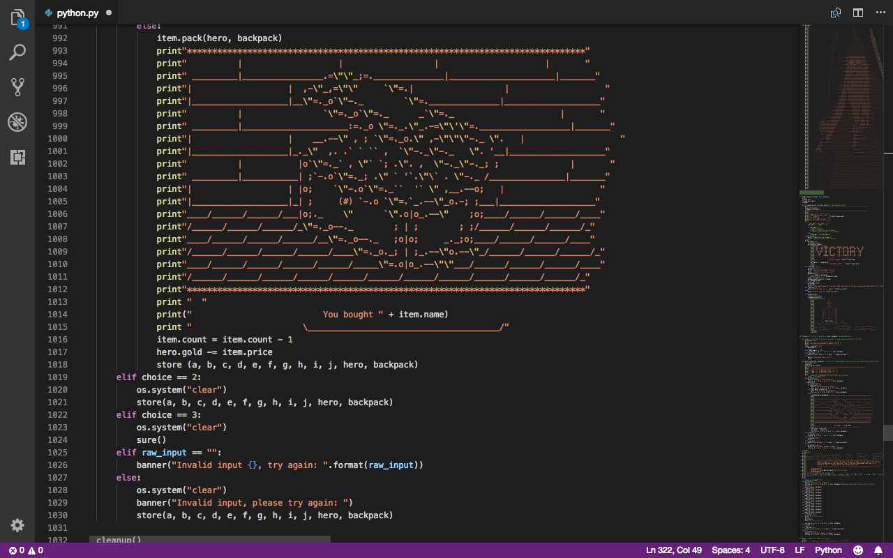
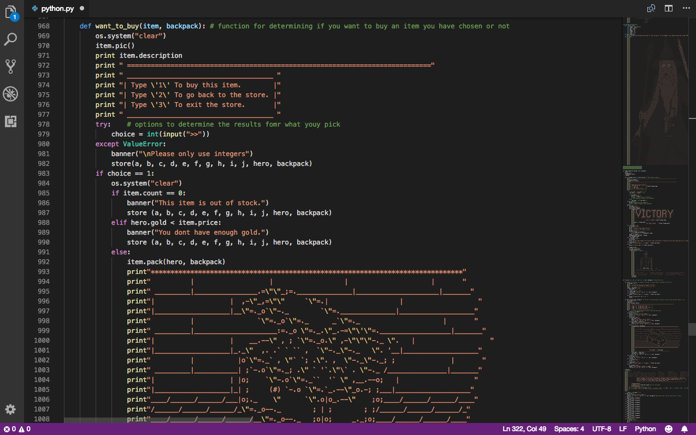

<h1>Python Dungeon Crawler</h1>

<h2>Description</h2>
This is a text based game created solely in Python. The game allows the user to play as a hero fighting through levels of a dungeon to reach the Dark Wizard at the bottom. The opponents are random, but will grow in difficulty per each level passed. The Hero receives coins per each opponent beaten and can use the coins to buy items between each floor in order to stay healthy and grow in strength.  

<h2>Technologies Used</h2>
<li>Python</li>
<h2>Images</h2>

